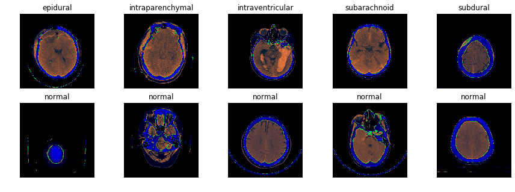

# RSNA Intracranial Hemorrhage Detection

This is the project for [RSNA Intracranial Hemorrhage Detection](https://www.kaggle.com/c/rsna-intracranial-hemorrhage-detection) hosted on Kaggle in 2019.

< 

**Final Solution**
EfficientNet b7. 5-folds. Dice images + preprocessing..

<br>

## Overview

### What is Intracranial Hemorrhage?

An intracranial hemorrhage is a type of bleeding that occurs inside the skull. Symptoms include sudden tingling, weakness, numbness, paralysis, severe headache, difficulty with swallowing or vision, loss of balance or coordination, difficulty understanding, speaking , reading, or writing, and a change in level of consciousness or alertness, marked by stupor, lethargy, sleepiness, or coma. Any type of bleeding inside the skull or brain is a medical emergency. It is important to get the person to a hospital emergency room immediately to determine the cause of the bleeding and begin medical treatment. It rquires highly trained specialists review medical images of the patient’s cranium to look for the presence, location and type of hemorrhage. The process is complicated and often time consuming. So as part of this we will be deep learning techniques to detect acute intracranial hemorrhage and its subtypes.

Hemorrhage Types

1. Epidural
2. Intraparenchymal    
3. Intraventricular
4. Subarachnoid 
5. Subdural
6. Any

## Motivation:

Human eyes can only detect approximately 6% changes in grey scale, meaning there must be at least a 120 [Hounsfield units (HU)](https://en.wikipedia.org/wiki/Hounsfield_scale) change for us to detect a difference. Intracranial hemorrhaging usually occurs within 70 to 80 HU, making these diagnoses impossible.

## Basic EDA:
* Our data was provided by the Radiological Society of North America (RSNA®) in collaboration with members of the American Society of Neuroradiology and MD.ai. 
* Data also contains a CSV file containing binary labels corresponding to each of the five hemorrhage sub-types and an additional label for ‘any’, that ignores sub-type. 
* Each DICOM file can be mapped to its labels within the CSV using its SOP Instance UID contained within the metadata. The metadata also includes various patient information. 
* The images within the DICOM files are stored as a 512 x 512 pixel arrays.
* Our data is extremely imbalanced. 94% of the images don’t have hemorrhages. Among the 6% of images depicting hemorrhages, the distribution of sub-types is also imbalanced as shown below:


* After pre-processing, we had about 160K images in the train set and 30K images in the test set.

## Approach:
1. **Rescaling:** Many CT scan images looked different because they were in raw pixel format and had to be converted into the appropriate HU unit format. Below is an example of how images look before and after the correction.


2. **Windowing:** The point of windowing is to extract important features from the original image. 

```python
def window_image_bottom(img, window_center, window_width):
    _, _, intercept, slope = get_windowing(img)
    img = img.pixel_array * slope + intercept
    img_min = window_center - window_width // 2
    img_max = window_center + window_width // 2
    img[img < img_min] = img_min
    img[img > img_max] = img_min
    img = (img - np.min(img)) / (np.max(img) - np.min(img))
    return img


def bsb_window(img):
    brain_img = window_image_bottom(img, 40, 80)
    subdural_img = window_image_bottom(img, 80, 200)
    bone_img = window_image_bottom(img, 600, 2000)
    
    bsb_img = np.zeros((brain_img.shape[0], brain_img.shape[1], 3))
    bsb_img[:, :, 0] = brain_img
    bsb_img[:, :, 1] = subdural_img
    bsb_img[:, :, 2] = bone_img
    return bsb_img

view_images([bsb_window(img) for img in imgs])
```


## Model

EfficientNet, scaled to different block layers (B1, B2, etc) 

